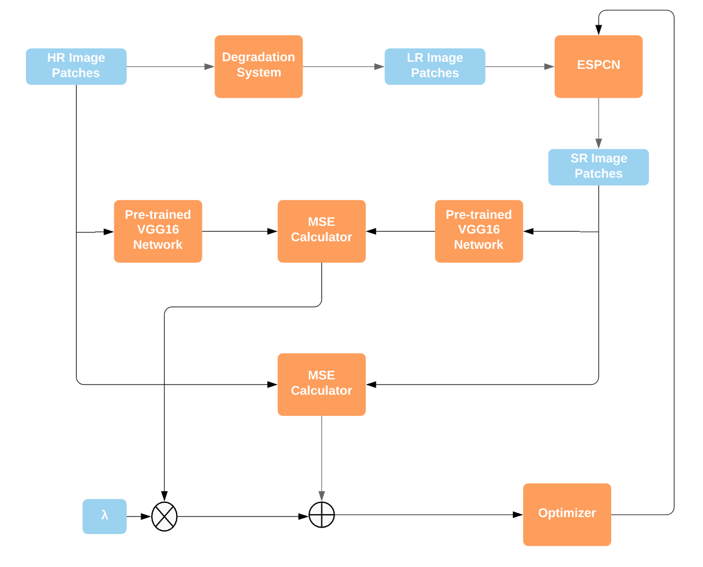
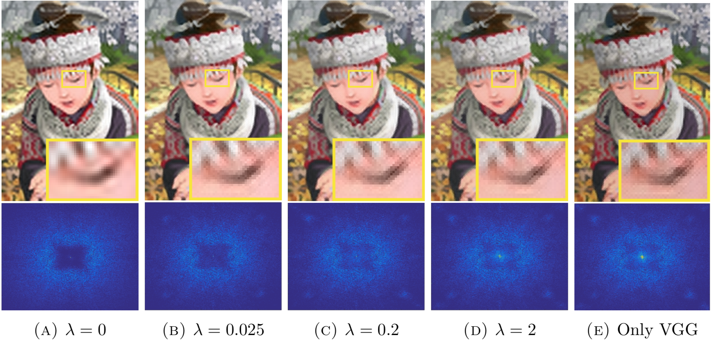

# ESPCN with Perceptual Loss

This repository implements the combination of two works: 

- [Sub-pixel Convolutional Neural Network (ESPCN)](https://www.cv-foundation.org/openaccess/content_cvpr_2016/papers/Shi_Real-Time_Single_Image_CVPR_2016_paper.pdf)
- [Perceptual Loss](https://arxiv.org/pdf/1603.08155.pdf%7C)
- Flow Chart of the SR System:

# Requirements
- PyTorch 1.10
- Numpy 1.16.1
- Pillow 6.0.0
- h5py 2.9.0
- matplotlib 3.1.1

# Datasets
The DIV2K, Set5 dataset converted to HDF5 can be downloaded from the following link:
[Datasets](https://github.com/yjn870/RDN-pytorch)

The custom dataset can also be created by following the instruction in the link above.

# Train
python train.py --training_set ".../DIV2K_x4.h5"  \ \
                                --val_set ".../Set5_x4.h5"  \ \
                                --scale 4  \ \
                                --patch_size 56  \ \
                                --epoch 200 
# Test
python test.py --weights "best_path.pth" \ \
               --test_img "img.png" \ \
               --scale 4
               
# Results
- 'comic' image results and FFT-Error plots:

